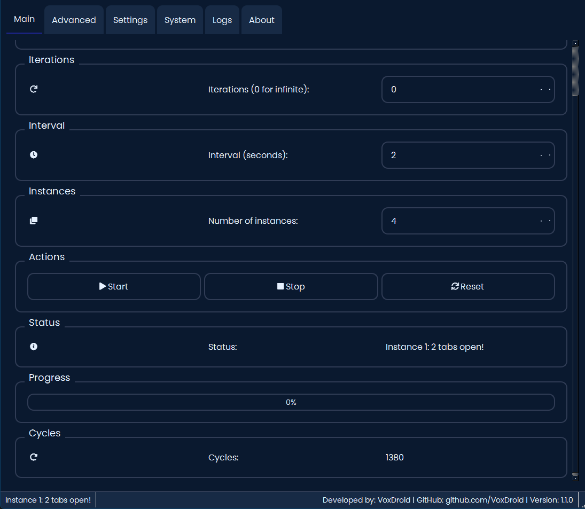
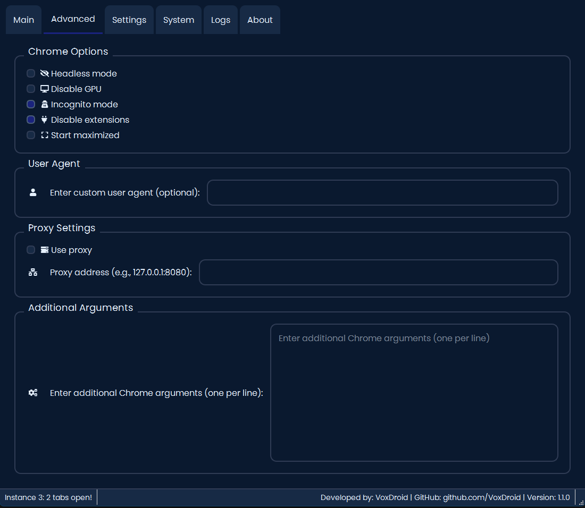
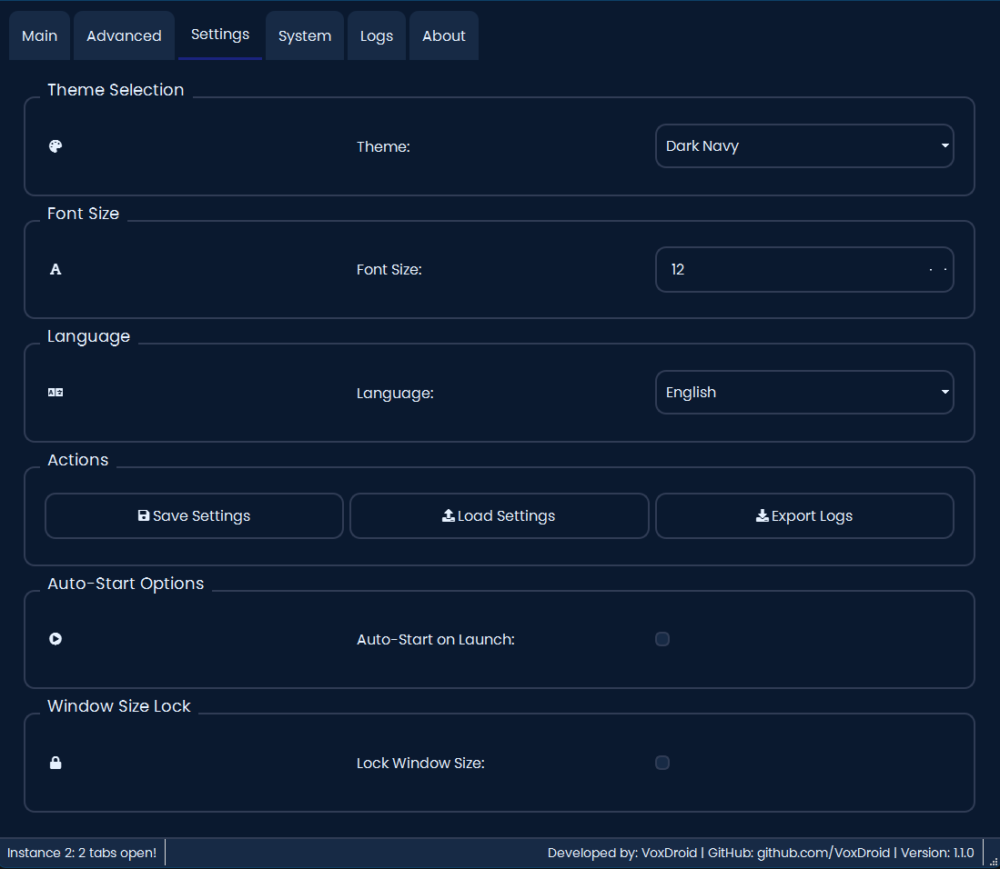
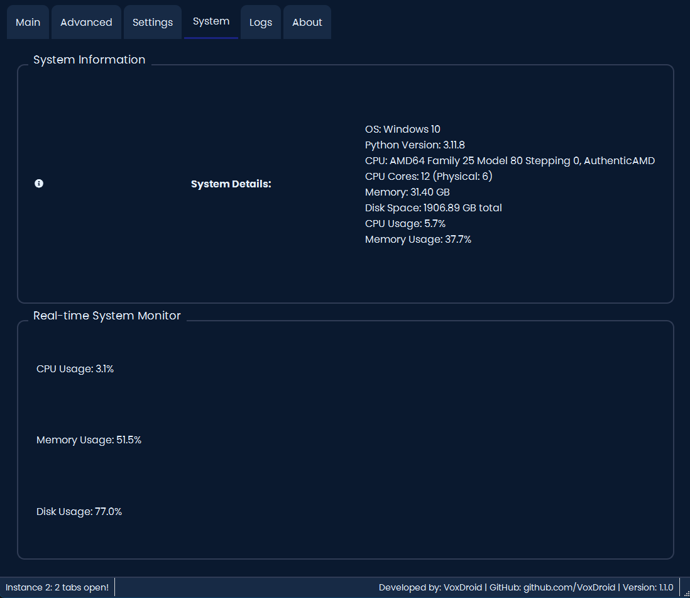
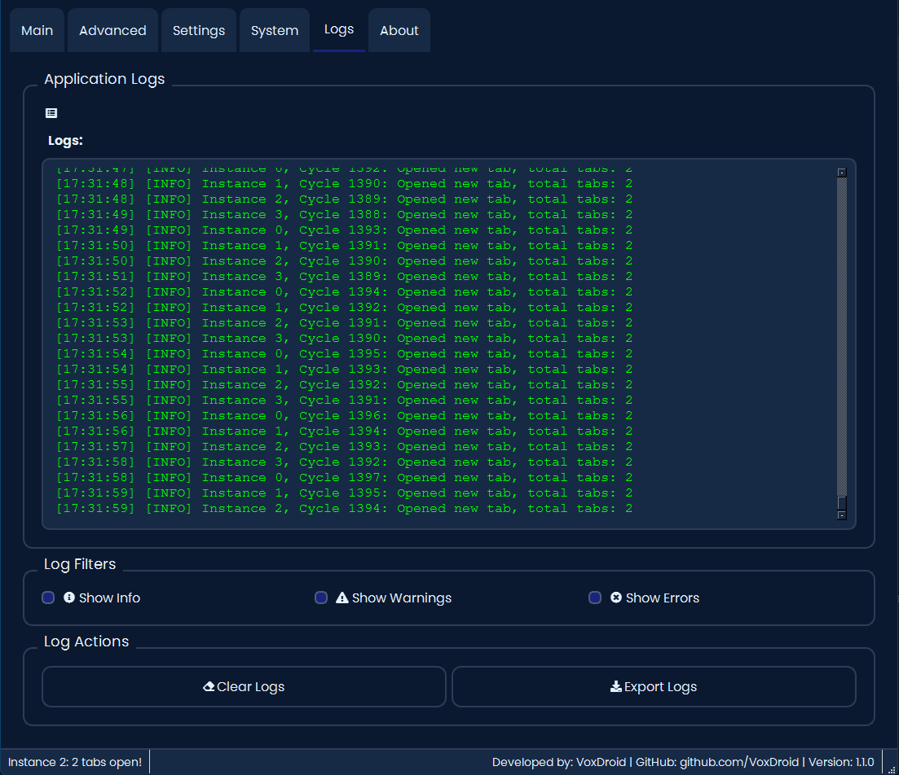

<h1 align="center">Advanced Tab Manager</h1>

<div align="center">
  
</div>

<br>

<div align="center">
  <a>
    
  </a>
</div>

<br>

<div align="center">
  <a href="https://github.com/VoxDroid/Advanced-Tab-Manager/blob/main/LICENSE">
    
  </a>
  <a href="https://github.com/VoxDroid/Advanced-Tab-Manager/releases">
    
  </a>
  <a href="https://github.com/VoxDroid/Advanced-Tab-Manager">
    
  </a>
  <a href="https://github.com/VoxDroid/Advanced-Tab-Manager/forks">
    
  </a>
  <a href="https://github.com/VoxDroid/Advanced-Tab-Manager/commits/main">
    
  </a>
  <a href="https://github.com/VoxDroid/Advanced-Tab-Manager/issues">
    
  </a>
  <a href="https://www.python.org/downloads/">
    
  </a>
  <a href="https://github.com/VoxDroid/Advanced-Tab-Manager">
    
  </a>
  <a href="https://github.com/VoxDroid/Advanced-Tab-Manager/releases">
    
  </a>
  <a>
    
  </a>
  <a href="https://voxdroid.github.io/Advanced-Tab-Manager/" target="_blank">
    
  </a>
</div>

<br>
<p align="center">
  <a href="https://ko-fi.com/O4O6LO7Q1" target="_blank">
    
  </a>
</p>
<br>

<hr style="border: 1px dashed #4A6B9A; margin: 20px 0;">

Welcome to **[Advanced Tab Manager Pro](https://github.com/VoxDroid/Advanced-Tab-Manager)**, a sophisticated Python-based desktop application built with [PyQt6](https://pypi.org/project/PyQt6/) and [Selenium](https://pypi.org/project/selenium/), designed to automate browser tab management with extensive customization options. This tool is ideal for developers, testers, and automation enthusiasts needing to efficiently manage multiple Chrome tabs across multiple instances, with features like headless mode, proxy support, multilingual interface, and real-time system monitoring.

## Table of Contents

- [Features](#features)
- [Supported Browsers](#supported-browsers)
- [Installation](#installation)
- [Usage](#usage)
  - [Getting Started](#getting-started)
  - [Main Tab](#main-tab)
  - [Advanced Tab](#advanced-tab)
  - [Settings Tab](#settings-tab)
  - [System Tab](#system-tab)
  - [Logs Tab](#logs-tab)
  - [About Tab](#about-tab)
- [Screenshots](#screenshots)
- [Releases](#releases)
- [Support](#support)
- [Contributing](#contributing)
- [Security](#security)
- [License](#license)
- [Dependencies](#dependencies)

## Features

- **Multi-Instance Tab Management**: Run multiple [Google Chrome](https://www.google.com/chrome/) instances simultaneously, each managing its own set of tabs.
- **Customizable Browser Options**: Support for headless mode, incognito, proxy settings, custom user agents, and additional Chrome arguments.
- **Multilingual Interface**: Supports English, Japanese, Korean, Chinese, and Filipino with dynamic language switching.
- **Themeable Interface**: Choose from six visually appealing themes (Dark Navy, Light Blue, Dark Green, Light Green, Soft Pink, Soft Lavender).
- **Real-Time System Monitoring**: Track CPU, memory, and disk usage with live updates using [psutil](https://pypi.org/project/psutil/).
- **Detailed Logging**: Color-coded logs with filtering (INFO, WARNING, ERROR) and export capabilities.
- **Advanced Configuration**: Fine-tune browser behavior with proxy settings, user agent customization, and Chrome command-line arguments.
- **Automatic Updates**: Check for new versions on startup with optional notifications using [requests](https://pypi.org/project/requests/).
- **Cross-Platform GUI**: Built with [PyQt6](https://pypi.org/project/PyQt6/) for a modern, intuitive interface compatible with Windows, macOS, and Linux.
- **Process Management**: Robust handling of Chrome and ChromeDriver processes to prevent resource leaks.
- **Error Handling**: Comprehensive error detection and logging for reliable operation.

## Supported Browsers

[Advanced Tab Manager Pro](https://github.com/VoxDroid/Advanced-Tab-Manager) currently supports:

- **[Google Chrome](https://www.google.com/chrome/)**: Managed via [Selenium WebDriver](https://www.selenium.dev/documentation/webdriver/) with automatic ChromeDriver installation using [webdriver-manager](https://pypi.org/project/webdriver-manager/).

*Note*: Support for additional browsers (e.g., Firefox, Edge) is planned for future releases.

## Installation

[Advanced Tab Manager Pro](https://github.com/VoxDroid/Advanced-Tab-Manager) is packaged as a Python application, making it easy to run or distribute across platforms. You can either build from source or use pre-compiled binaries where available.

### Building from Source (All Platforms)

1. Ensure you have **Python 3.8+** installed on your system (Windows, macOS, Linux).

2. Clone this repository:

   ```bash
   git clone https://github.com/VoxDroid/Advanced-Tab-Manager.git
   cd Advanced-Tab-Manager
   ```

3. Install dependencies:

   ```bash
   python -m pip install -r requirements.txt
   ```

   If [requirements.txt](https://github.com/VoxDroid/Advanced-Tab-Manager/blob/main/requirements.txt) is not present, manually install:

   ```bash
   python -m pip install PyQt6 selenium psutil qtawesome webdriver-manager requests packaging briefcase
   ```

4. Run the application:

   ```bash
   python app.py
   ```

   This will launch the GUI using [app.py](https://github.com/VoxDroid/Advanced-Tab-Manager/blob/main/src/advancedtabmanager/app.py) and automatically install the appropriate ChromeDriver version via [webdriver-manager](https://pypi.org/project/webdriver-manager/).

### Pre-Compiled Binaries

- **Windows**: Download the latest `.exe` (portable) or `.msi` (installer) tagged with `[W]` for Windows, from the [Releases](https://github.com/VoxDroid/Advanced-Tab-Manager/releases) page. Run the MSI installer or use the portable version for no-setup runs.
- **macOS**: Download the latest universal `.dmg` (x86_64 and Apple Silicon) tagged with `[M]` for macOS, from the [Releases](https://github.com/VoxDroid/Advanced-Tab-Manager/releases) page. Open the DMG, drag the app to Applications, and launch it.
- **Linux**: Download the latest `.rpm` (for Fedora/Red Hat), `.deb` (for Debian/Ubuntu), or `.pkg.tar.zst` (for Arch/Pacman) tagged with `[L]` for Linux, from the [Releases](https://github.com/VoxDroid/Advanced-Tab-Manager/releases) page. Run the installer and launch the app.

*Note*: Pre-compiled binaries require [Google Chrome](https://www.google.com/chrome/) to be installed on the system.

## Usage

Upon launching [Advanced Tab Manager Pro](https://github.com/VoxDroid/Advanced-Tab-Manager), you’ll see the main interface featuring six tabs: **Main**, **Advanced**, **Settings**, **System**, **Logs**, and **About**. The in-app [About Tab](#about-tab) contains additional usage information.

### Getting Started

- Launch the application using `python [app.py](https://github.com/VoxDroid/Advanced-Tab-Manager/blob/main/src/advancedtabmanager/app.py)` or a pre-compiled binary.
- Explore the [Main Tab](#main-tab) to configure and start tab management tasks.
- Customize browser options in the [Advanced Tab](#advanced-tab) and application settings in the [Settings Tab](#settings-tab).
- Monitor system resources in the [System Tab](#system-tab) and view detailed logs in the [Logs Tab](#logs-tab).
- Refer to the [About Tab](#about-tab) for application details and licensing information.

### Main Tab

- **Purpose**: Configure and control tab management tasks.
- **How to Use**:
  1. Enter a valid URL (e.g., `https://google.com`) in the URL field.
  2. Set the number of iterations (0 for infinite) and interval (seconds) between tab openings.
  3. Specify the number of browser instances (1–10).
  4. Click "Start" to begin opening tabs, "Stop" to halt operations, or "Reset" to clear fields.
  5. Monitor the status, progress bar, and cycle count for real-time updates.

### Advanced Tab

- **Purpose**: Customize [Google Chrome](https://www.google.com/chrome/) browser options.
- **How to Use**:
  1. Enable options like headless mode, incognito, or disable GPU/extensions.
  2. Set a custom user agent or enable proxy settings with an IP:PORT address.
  3. Add additional Chrome command-line arguments (one per line).
  4. These settings apply to all instances when starting a task.

### Settings Tab

- **Purpose**: Customize the application’s appearance and behavior.
- **How to Use**:
  1. Select a theme (e.g., Dark Navy, Soft Pink) or adjust font size (8–24 pt).
  2. Choose a language (English, Japanese, Korean, Chinese, Filipino).
  3. Enable auto-start or lock window size options.
  4. Save or load settings, export logs, or clear the log viewer.

### System Tab

- **Purpose**: Monitor system resources.
- **How to Use**:
  1. View real-time CPU, memory, and disk usage percentages using [psutil](https://pypi.org/project/psutil/).
  2. Check detailed system information (OS, processor, RAM, etc.).
  3. Use this tab to ensure your system can handle multiple browser instances.

### Logs Tab

- **Purpose**: View and manage application logs.
- **How to Use**:
  1. Monitor color-coded logs (INFO, WARNING, ERROR) with timestamps.
  2. Filter logs by level (e.g., show only errors) using checkboxes.
  3. Export logs to a text file or clear the log viewer.

### About Tab

- **Purpose**: Access application and licensing information.
- **How to Use**:
  1. View details about the application, including version and developer info.
  2. Check the [MIT License](https://github.com/VoxDroid/Advanced-Tab-Manager/blob/main/LICENSE) details via a clickable link.
  3. Find links to the [GitHub repository](https://github.com/VoxDroid/Advanced-Tab-Manager) and [Support](#support) channels.

## Screenshots

Here are previews of the main tabs in [Advanced Tab Manager Pro](https://github.com/VoxDroid/Advanced-Tab-Manager):

<table style="min-width: 50px">
<colgroup><col style="min-width: 25px"><col style="min-width: 25px"></colgroup>
<tbody>
<tr class="border-border">
<td colspan="1" rowspan="1"><p dir="ltr"><br><strong>Main Tab</strong><br></p></td>
<td colspan="1" rowspan="1"><p dir="ltr"><br><strong>Advanced Tab</strong><br></p></td>
</tr>
<tr class="border-border">
<td colspan="1" rowspan="1"><p dir="ltr"><br><strong>Settings Tab</strong><br></p></td>
<td colspan="1" rowspan="1"><p dir="ltr"><br><strong>System Tab</strong><br></p></td>
</tr>
<tr class="border-border">
<td colspan="1" rowspan="1"><p dir="ltr"><br><strong>Logs Tab</strong><br></p></td>
<td colspan="1" rowspan="1"><p dir="ltr"><br><strong>About Tab (Coming Soon)</strong><br></p></td>
</tr>
</tbody>
</table>

*Note*: Screenshots assume the presence of `assets/screenshots/` directory in the repository. Ensure these files exist or update paths in [README.md](https://github.com/VoxDroid/Advanced-Tab-Manager/blob/main/README.md) accordingly.

## Releases

- **Windows**: Pre-compiled `.exe` (portable) or `.msi` (installer) tagged with `[W]` for Windows, available in the [Releases](https://github.com/VoxDroid/Advanced-Tab-Manager/releases) section.
- **macOS**: Pre-compiled universal `.dmg` (x86_64 and Apple Silicon) tagged with `[M]` for macOS, available in the [Releases](https://github.com/VoxDroid/Advanced-Tab-Manager/releases) section.
- **Linux**: Pre-compiled `.rpm` (for Fedora/Red Hat), `.deb` (for Debian/Ubuntu), or `.pkg.tar.zst` (for Arch/Pacman) tagged with `[L]` for Linux, available in the [Releases](https://github.com/VoxDroid/Advanced-Tab-Manager/releases) section.
- Check [release notes](https://github.com/VoxDroid/Advanced-Tab-Manager/releases) for details on new features, bug fixes, and version updates.
- The Python source ([app.py](https://github.com/VoxDroid/Advanced-Tab-Manager/blob/main/src/advancedtabmanager/app.py)) remains the primary method, supporting all platforms with proper setup.

## Support

For ways to get help, report issues, or support the project’s development, please see the following:

- **Issues**: Report bugs or suggest features on the [Issues](https://github.com/VoxDroid/Advanced-Tab-Manager/issues) page.
- **Discussions**: Join community discussions on the [Discussions](https://github.com/VoxDroid/Advanced-Tab-Manager/discussions) page.
- **Email**: Contact the developer at [izeno.contact@gmail.com](mailto:izeno.contact@gmail.com) for private inquiries.
- **Ko-fi**: Support the project financially at [ko-fi.com/izeno](https://ko-fi.com/izeno).

## Contributing

[Advanced Tab Manager Pro](https://github.com/VoxDroid/Advanced-Tab-Manager) is open-source, and contributions are encouraged! Please read our [Contributing Guidelines](https://github.com/VoxDroid/Advanced-Tab-Manager/blob/main/CONTRIBUTING.md), [Code of Conduct](https://github.com/VoxDroid/Advanced-Tab-Manager/blob/main/CODE_OF_CONDUCT.md), and [Security Policy](https://github.com/VoxDroid/Advanced-Tab-Manager/blob/main/SECURITY.md) before submitting issues or pull requests. Use the appropriate issue templates for reporting bugs, suggesting features, or other contributions, and the Pull Request template for code submissions.

1. Fork the repository at [VoxDroid/Advanced-Tab-Manager](https://github.com/VoxDroid/Advanced-Tab-Manager).

2. Clone your fork:

   ```bash
   git clone https://github.com/VoxDroid/Advanced-Tab-Manager.git
   ```

3. Create a branch:

   ```bash
   git checkout -b feature/your-feature
   ```

4. Make changes and commit:

   ```bash
   git add .
   git commit -m "Describe your changes"
   ```

5. Push to your fork:

   ```bash
   git push origin feature/your-feature
   ```

6. Open a Pull Request on [GitHub](https://github.com/VoxDroid/Advanced-Tab-Manager).

## Security

If you discover a security vulnerability, please follow our [Security Policy](https://github.com/VoxDroid/Advanced-Tab-Manager/blob/main/SECURITY.md) by emailing [izeno.contact@gmail.com](mailto:izeno.contact@gmail.com) or using the Security Report issue template on the [Issues](https://github.com/VoxDroid/Advanced-Tab-Manager/issues) page for non-sensitive issues.

## License

This project is licensed under the [MIT License](https://github.com/VoxDroid/Advanced-Tab-Manager/blob/main/LICENSE). See the [LICENSE](https://github.com/VoxDroid/Advanced-Tab-Manager/blob/main/LICENSE) file for details.

## Dependencies

To build from source, install the following Python packages:

- [PyQt6](https://pypi.org/project/PyQt6/) (for the GUI)
- [selenium](https://pypi.org/project/selenium/) (for browser automation)
- [psutil](https://pypi.org/project/psutil/) (for system monitoring)
- [qtawesome](https://pypi.org/project/qtawesome/) (for icons)
- [webdriver-manager](https://pypi.org/project/webdriver-manager/) (for ChromeDriver management)
- [requests](https://pypi.org/project/requests/) (for HTTP requests)
- [packaging](https://pypi.org/project/packaging/) (for version parsing)

Create a [requirements.txt](https://github.com/VoxDroid/Advanced-Tab-Manager/blob/main/requirements.txt) file with these dependencies and run:

```bash
pip install -r requirements.txt
```

---

**Developed by [VoxDroid](https://github.com/VoxDroid)**  
[GitHub](https://github.com/VoxDroid) | [Ko-fi](https://ko-fi.com/izeno)

---
